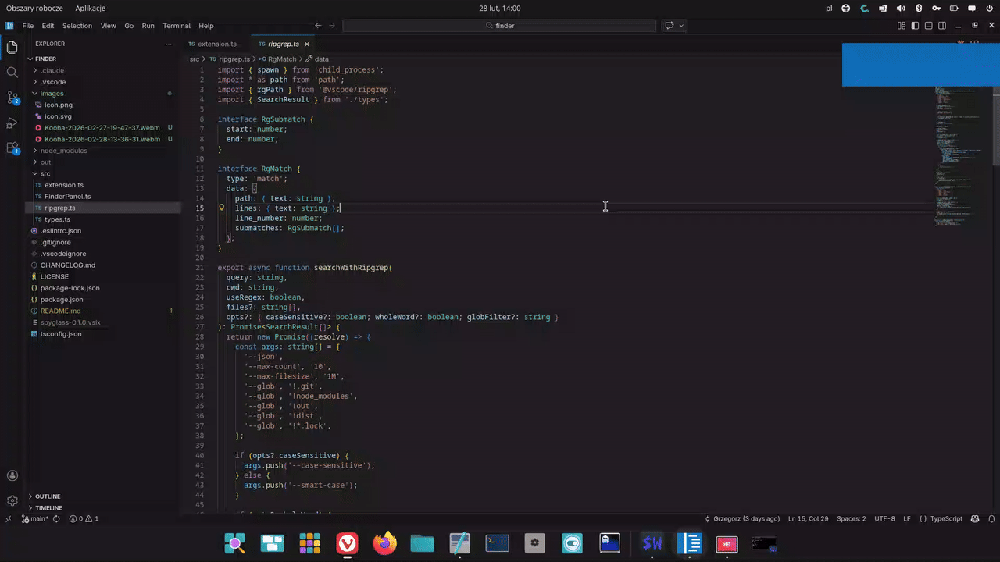
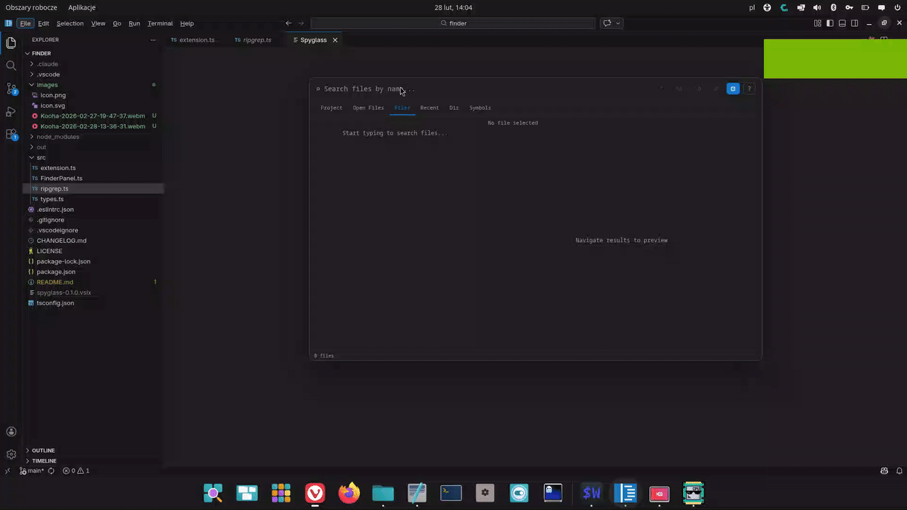
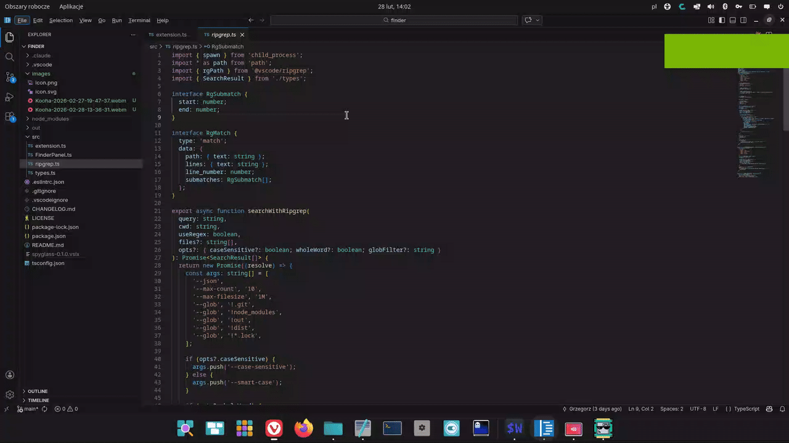

<h1 align="center">
  <br/>
  Spyglass
</h1>

<p align="center">
  <strong>Fast, keyboard-driven search popup for VS Code</strong><br/>
  Inspired by <a href="https://github.com/nvim-telescope/telescope.nvim">Neovim Telescope</a> and JetBrains Search Everywhere
</p>

<p align="center">
  <a href="https://marketplace.visualstudio.com/items?itemName=piotrmacai.spyglass">
    
  </a>
  <a href="https://marketplace.visualstudio.com/items?itemName=piotrmacai.spyglass">
    
  </a>
  <a href="https://marketplace.visualstudio.com/items?itemName=piotrmacai.spyglass">
    
  </a>
  <a href="LICENSE">
    
  </a>
</p>

<p align="center">
  Open with <kbd>Ctrl+Alt+F</kbd> — Type — Navigate — Done.
</p>

---

## 📸 Screenshots

**Full-text search with live preview**



**File search and recent files**



**Split editor**



---

## ✨ Features

### 🔍 Search
- **Full-text search** across the whole project powered by ripgrep (blazing fast)
- **Fuzzy file search** — search by filename with character-level match highlighting
- **Symbol search** — workspace symbols via LSP (classes, functions, variables…)
- **Regex mode** toggle for power users
- **Case sensitive** and **whole word** toggles
- **Glob filter** — limit search to specific file patterns (`*.ts`, `!*.test.ts`)

### 🗂️ Navigation
- **6 search scopes** — Project, Open Files, Files, Recent, Dir, Symbols
- **Recent files** — instantly access your most recently opened files
- **Dir scope** — search only within the directory of the active file
- **Search history** — navigate previous queries with `Ctrl+↑` / `Ctrl+↓`
- **Multi-select** — pick multiple results and open them all at once

### 👁️ Preview
- **Live preview** — file content as you navigate, with syntax highlighting
- **Git change indicators** — modified lines highlighted in the gutter
- **Theme adaptive** — works with any VS Code theme (dark, light, high contrast)

### ⚡ Actions
- **Find & Replace** — replace across all matched files instantly (with undo)
- **Copy path** — copy the absolute path of the selected result
- **Reveal in Explorer** — click the preview header to locate the file
- **Open in split** — open any result beside the current editor
- **Pre-fill from selection** — select text, open Spyglass → query is pre-filled
- **Zero dependencies** — ripgrep is bundled, nothing to install

---

## 🚀 Usage

### Opening Spyglass

| Action | Shortcut |
|--------|----------|
| Open Spyglass | `Ctrl+Alt+F` |

> **VSCode Vim users** — bind `<Space>f` as your leader shortcut. See [Vim setup](#-vim-setup) below.

### ⌨️ Keyboard shortcuts

| Action | Shortcut |
|--------|----------|
| Navigate results | `↑` / `↓` |
| Open selected file | `Enter` |
| Open in split editor | `Ctrl+Enter` |
| Switch scope | `Tab` |
| Close | `Escape` |
| Toggle regex | `Shift+Alt+R` |
| Toggle case sensitive | `Alt+C` |
| Toggle whole word | `Alt+W` |
| Toggle preview panel | `Shift+Alt+P` |
| Toggle replace mode | `Alt+R` |
| History — previous query | `Ctrl+↑` |
| History — next query | `Ctrl+↓` |
| Copy path | `Alt+Y` |
| Multi-select toggle | `Ctrl+Space` / `Ctrl+Click` |
| Select all results | `Ctrl+A` |
| Open all selected | `Shift+Enter` |
| Reveal in Explorer | click the preview header |

---

## 🗺️ Search Scopes

| Scope | Description |
|-------|-------------|
| **Project** | Full-text search across all files in the workspace |
| **Open Files** | Full-text search only within currently open editor tabs |
| **Files** | Fuzzy search by filename across the whole project |
| **Recent** | Recently opened files, ordered by most recent |
| **Dir** | Full-text search within the directory of the active file |
| **Symbols** | Workspace symbol search via LSP (requires a language extension) |

Switch between scopes with `Tab` while Spyglass is open.

---

## 🔄 Find & Replace

1. Open Spyglass and type your search query
2. Press `Alt+R` (or click `⇄`) to enable replace mode
3. Type the replacement text in the second field
4. Optionally tune case-sensitive / whole-word / glob filter
5. Click **Replace all** — all matches replaced instantly via VS Code's edit API (supports undo)

---

## 👁️ Preview Panel

The right-side preview shows the file around the matched line with syntax highlighting.
Lines modified since the last git commit are marked with a **blue indicator** in the gutter.

- Toggle with `Shift+Alt+P` or the `⊡` button
- Click the preview header to **Reveal in Explorer**

---

## ⚙️ Settings

| Setting | Default | Description |
|---------|---------|-------------|
| `spyglass.defaultScope` | `project` | Scope on open: `project` `openFiles` `files` `recent` `here` `symbols` |
| `spyglass.maxResults` | `200` | Maximum number of results to display |
| `spyglass.keybindings.navigateDown` | `ArrowDown` | Navigate down in results |
| `spyglass.keybindings.navigateUp` | `ArrowUp` | Navigate up in results |
| `spyglass.keybindings.open` | `Enter` | Open selected result |
| `spyglass.keybindings.close` | `Escape` | Close Spyglass |
| `spyglass.keybindings.toggleRegex` | `shift+alt+r` | Toggle regex mode |
| `spyglass.keybindings.togglePreview` | `shift+alt+p` | Toggle preview panel |

---

## 🎹 Customizing Keybindings

### Change the open shortcut

Open **Keyboard Shortcuts** (`Ctrl+K Ctrl+S`), search for `Spyglass: Open Search` and assign your preferred key.

Or edit `keybindings.json` directly (`Ctrl+Shift+P` → *Open Keyboard Shortcuts (JSON)*):

```json
[
  {
    "key": "ctrl+alt+f",
    "command": "spyglass.open",
    "when": "!inputFocus || editorTextFocus"
  }
]
```

### Change shortcuts inside the panel

Add to your `settings.json`:

```json
{
  "spyglass.keybindings.navigateDown": "j",
  "spyglass.keybindings.navigateUp": "k",
  "spyglass.keybindings.toggleRegex": "ctrl+r",
  "spyglass.keybindings.togglePreview": "ctrl+p"
}
```

---

## 🟢 Vim Setup

If you use the [VSCode Vim extension](https://marketplace.visualstudio.com/items?itemName=vscodevim.vim), bind `<Space>f` just like Telescope in Neovim.

Add to your `settings.json`:

```json
{
  "vim.normalModeKeyBindingsNonRecursive": [
    {
      "before": ["<Space>", "f"],
      "commands": ["spyglass.open"]
    }
  ]
}
```

To disable the default `Ctrl+Alt+F` binding:

```json
[
  {
    "key": "ctrl+alt+f",
    "command": "-spyglass.open"
  }
]
```

---

## 📋 Requirements

- VS Code `^1.85.0`
- No additional dependencies — ripgrep is bundled automatically
- Git *(optional)* — required for change indicators in the preview panel
- A language server extension *(optional)* — required for the **Symbols** scope

---

## 🤝 Contributing

PRs and issues welcome at [github.com/garroter/spyglass](https://github.com/garroter/spyglass).

---

## 📄 License

MIT
